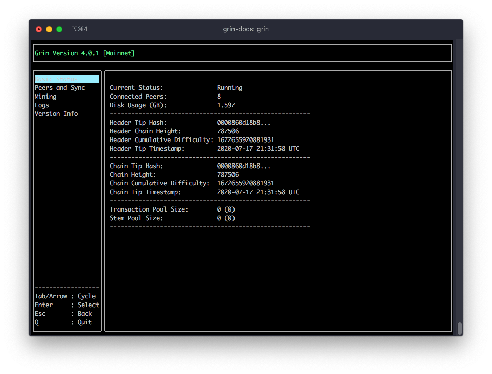

# Quickstart

In this tutorial we will see how to:

- Download and install Grin and Grin-Wallet.
- Run a Grin Full Node
- Create a Grin-Wallet
- Learn to receive and send grins

## Requirements

Grin and Grin-Wallet softwares are compatible with Linux, macOS and Windows.
Specifically it has been tested on:

- Ubuntu 18.04 (earlier versions will work but you'll need to compile )
- Windows 10
- macOS 10.15 Catalina

## Download Grin and Grin-Wallet

!!! info
    The following section will help you install Grin and Grin-Wallet using precompiled binaries.

    If you wish to build Grin and Grin-wallet go the [building section](TODO).

### Linux

#### Using the Snap Store

If you have Snap installed simply type:

```bash
snap install grin
```

!!! tip
    You can now follow the rest of the documentation. Please note that, when installed with Snap,
    Grin-Wallet is accessible using the `grin.wallet` command instead of `grin-wallet`.

#### Manually

If your distribution does not include `snap` or if you do not wish to use it, you can download the binaries by yourself.

On [Grin website](https://grin.mw/download), download Grin and Grin-Wallet.

Next, open a new terminal windows in the directory where the files were downloaded and type:

```bash
sudo tar -C /usr/local/bin -xzf grin-$VERSION-linux-amd64.tar.gz --strip-components=1
sudo tar -C /usr/local/bin -xzf grin-wallet-$VERSION-linux-amd64.tar.gz --strip-components=1
```

This will install `grin` and `grin-wallet`.

!!! warning
    If you have the following error whe you try to start Grin:

    ```bash
    grin: error while loading shared libraries: libncursesw.so.5: cannot open shared object file: No such file or directory
    ```

    Simply install `libncursesw5`:

    ```bash
    sudo apt install libncursesw5
    ```

    If you wish to build Grin and Grin-wallet go the [building section](TODO).

### macOS

The easiest way to install Grin and Grin-Wallet on macOS is with [homebrew](https://brew.sh).

If you do not have homebrew installed, open the "Terminal.app" and paste the following line:

```bash
/bin/bash -c "$(curl -fsSL https://raw.githubusercontent.com/Homebrew/install/master/install.sh)"
```

This will install homebrew on your computer. Once it is finished you can now install Grin and Grin-Wallet:

```bash
brew install grin grin-wallet
```

That's it! You have the latest version of Grin and Grin-Wallet.

If later you want to update to the latest version simply run:

```bash
brew update
```

### Windows

On Windows 10, the easiest way to install Grin and Grin-Wallet is by downloading the binaries on [Grin website](https://grin.mw/download).

We recommed that you create a directory called `grin` in `C:\Users\%USER%`. In this directory, extract both `grin.exe` and `grin-wallet.exe`.

That's it, Grin and Grin-Wallet are installed!

## Running a Grin Node

!!! info
    The rest of the documentation is common for Linux, macOS and Windows.

    On Windows, you will need to replace the `grin` and `grin-wallet` commands with
    `grin.exe` and `grin-wallet.exe`.

Running a Grin node is as simple as writting the followig command in your command prompt:

```bash
grin
```

You should see the following window:



Congratulations 🎉! You now have a fully running Grin full node.
The initial sync might take from 30 minutes to a few hours depending on your connection speed and CPU performance.

## Creating a Grin Wallet

While your node is syncing, let's create a new Grin wallet.

In the command prompt type the followig:

```bash
grin-wallet init
```

Your wallet will now ask for a password. This password is optional. Enter it 2 times.
In order to hide your password, your keyboard input will not be displayed.

```text
Please enter a password for your new wallet
Password:
Confirm Password:
```

On you have entered the same password two times, the wallet will show your recovery phrase:

```text
Your recovery phrase is:

undo execute festival romance just void custom leopard balcony trick waste castle fire master lecture ordinary million slam wise oil whisper mechanic episode room
```

Store it somewhere safe, preferably on a non digital format.

That's it, your wallet is now created.
